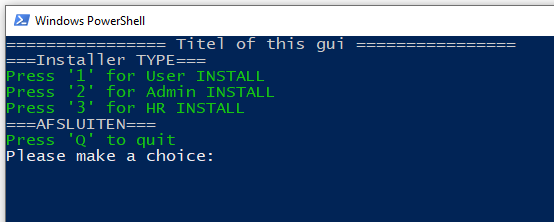
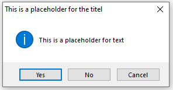
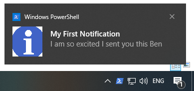
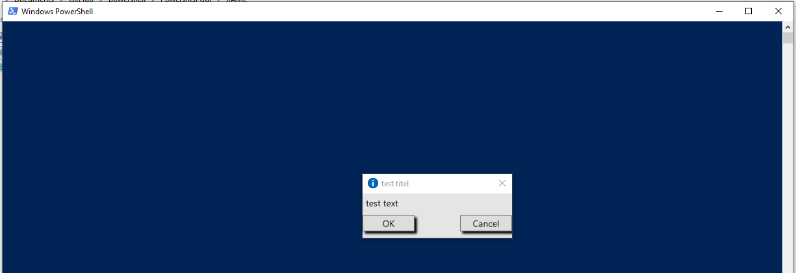
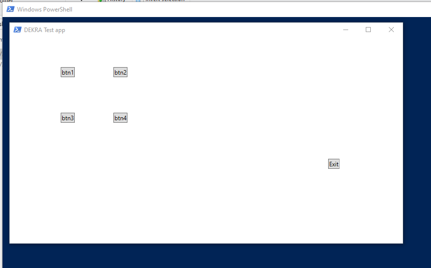
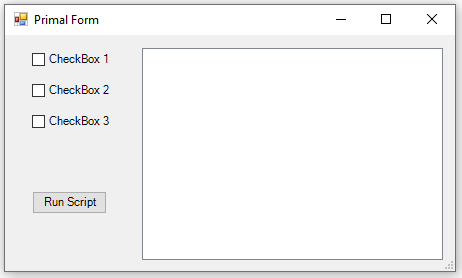
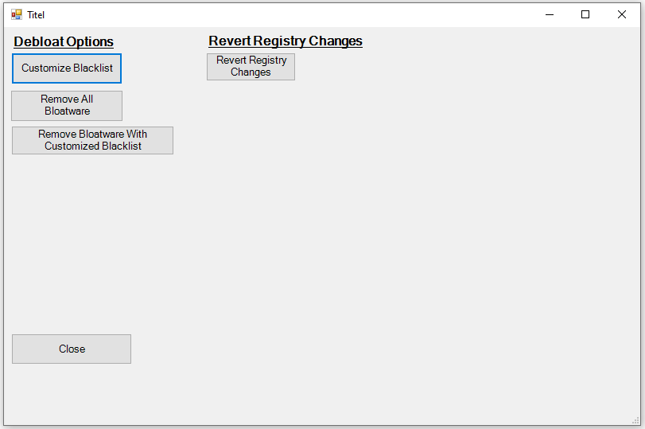
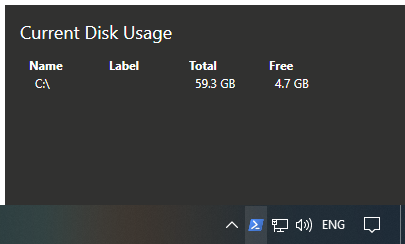

# powershell gui scripts
powershell can create many gui interfaces.
I have created and colected the scripts to make this possible.

--------
## Baloontip
.PNG)
## Console

## customupgradescreen
no preview
## msgbox

## Toaster-popup

## XAML

## csharp

## taskbar-popup

